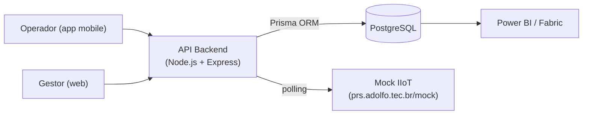
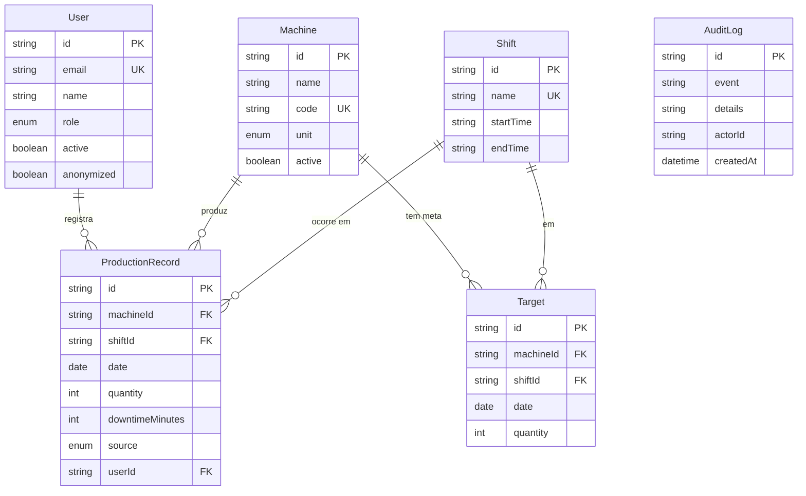
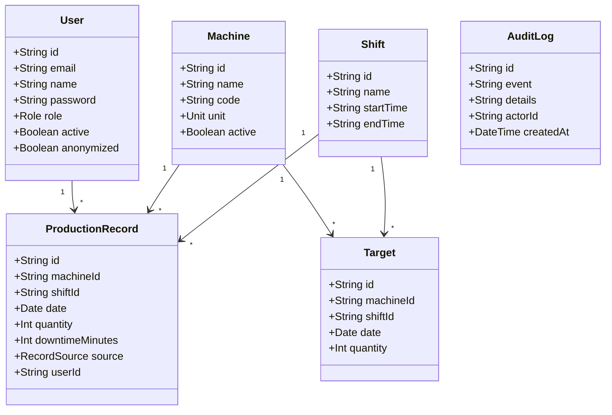
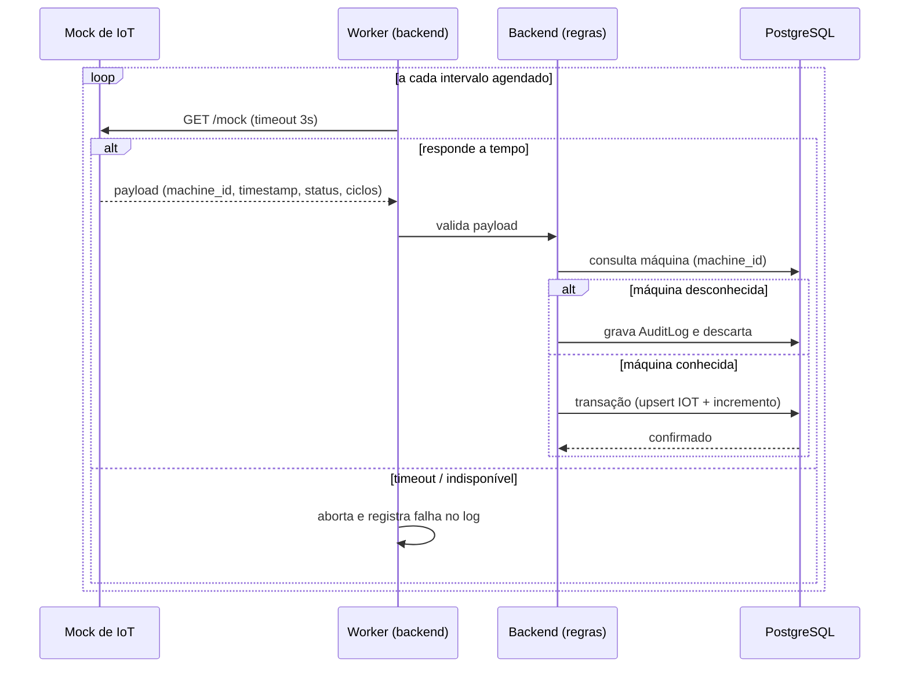

# Especificação de Requisitos de Software (SRS)

> **Norma de referência:** ISO/IEC/IEEE 29148:2018
> **Projeto:** ProdTrack — Plataforma para Gestão Industrial
> **Versão:** 1.0
> **Data:** 29/08/2026
> **Autor:** Rafael Adolfo Silva Ferreira

---

## Histórico de Revisões

| Versão | Data | Autor | Alterações |
|--------|------|-------|------------|
| 1.0 | 29/08/2026 | Rafael Adolfo Silva Ferreira | Rascunho inicial — especificação completa do MVP ProdTrack |

---

## 1. Introdução

### 1.1 Propósito (Purpose)

Este documento especifica os requisitos de software da plataforma **ProdTrack**, uma solução de apontamento produtivo e gestão industrial desenvolvida pela PRS Tecnologia. O ProdTrack tem por finalidade digitalizar a coleta de dados de produção no chão de fábrica, harmonizando o registro manual de operadores — via aplicativo móvel — com a telemetria automatizada de máquinas — via serviço Mock de IIoT (Internet Industrial das Coisas) — e estruturando esses dados para alimentação de ecossistemas analíticos corporativos (Power BI Embed, Microsoft Fabric).

A especificação segue a estrutura normativa da seção 9.6 da ISO/IEC/IEEE 29148:2018 e estabelece, de forma verificável e não ambígua, os requisitos funcionais, lógicos e de desempenho que o sistema deve atender em seu Produto Mínimo Viável (MVP).

### 1.2 Escopo (Scope)

- **a) Identificação do produto:** O produto de software é denominado **ProdTrack**, compreendendo três componentes distribuídos: (i) interface web gerencial, (ii) API backend (motor de regras) e (iii) aplicativo móvel do operador. Um serviço satélite, o **Mock de IoT**, é mantido como subsistema de simulação de telemetria.
- **b) O que o produto fará:** O ProdTrack realizará o cadastro e a gestão de máquinas, turnos e metas de produção; registrará apontamentos produtivos (quantidade produzida e tempo de parada) por operadores; ingerirá sinais de telemetria simulados por polling assíncrono; consolidará indicadores de eficiência em dashboard; emitirá alertas de baixo desempenho; e exportará dados tabulares em CSV para consumo externo.
- **c) Descrição da aplicação (benefícios, objetivos e metas):** A aplicação elimina a latência informacional entre a execução da manufatura e a tomada de decisão gerencial, substituindo controles manuais e planilhas descentralizadas por uma fonte de dados única, tipada e íntegra. O objetivo central é prover a camada fundacional de ingestão de dados para painéis analíticos corporativos.
- **d) Consistência com especificações de nível superior:** Este SRS materializa o escopo funcional descrito na *Especificação Arquitetural e Engenharia de Requisitos da Plataforma ProdTrack* (documento de visão do produto).

### 1.3 Referências (References)

| Referência | Título | Versão | Data | Fonte |
|------------|--------|--------|------|-------|
| [REF-001] | ISO/IEC/IEEE 29148:2018 — Systems and software engineering — Life cycle processes — Requirements engineering | 2018 | 2018 | ISO |
| [REF-002] | Especificação Arquitetural e Engenharia de Requisitos — Plataforma ProdTrack | 1.0 | 2026 | PRS Tecnologia |
| [REF-003] | Lei nº 13.709/2018 — Lei Geral de Proteção de Dados Pessoais (LGPD) | — | 2018 | Governo Federal |
| [REF-004] | Prisma ORM — Documentação oficial | — | 2026 | prisma.io |
| [REF-005] | PostgreSQL 16 — Documentação oficial | 16.x | 2026 | postgresql.org |

### 1.4 Termos (Terms)

| Termo | Definição |
|-------|-----------|
| Apontamento | Registro transacional de produção (quantidade e tempo de parada) associado a uma máquina, turno e data. |
| Máquina | Equipamento industrial cadastrado, portador de código alfanumérico único e unidade de medida de produção. |
| Turno | Período lógico de operação da fábrica, delimitado por horário de início e término. |
| Meta | Alvo quantitativo de produção para uma combinação única de máquina, turno e data. |
| Eficiência | Quociente percentual entre produção real e produção planejada (meta). |
| Mock de IoT | Serviço simulador de telemetria que representa um gêmeo digital simplificado de CLPs industriais. |
| Polling assíncrono | Estratégia de comunicação em que o backend interroga periodicamente o serviço de telemetria. |
| Soft Delete | Exclusão lógica de registro, preservando a estrutura histórica do banco de dados. |

### 1.5 Abreviações (Abbreviations)

| Abreviação | Significado |
|------------|-------------|
| SRS | Software Requirements Specification |
| MVP | Minimum Viable Product (Produto Mínimo Viável) |
| API | Application Programming Interface |
| REST | Representational State Transfer |
| JWT | JSON Web Token |
| RBAC | Role-Based Access Control |
| IIoT | Industrial Internet of Things |
| IoT | Internet of Things |
| CLP | Controlador Lógico Programável |
| ORM | Object-Relational Mapping |
| VPS | Virtual Private Server |
| TLS/SSL | Transport Layer Security / Secure Sockets Layer |
| CSV | Comma-Separated Values |
| UUID | Universally Unique Identifier |
| LGPD | Lei Geral de Proteção de Dados |
| B-Tree | Balanced Tree (índice de banco de dados) |
| p95 | Percentil 95 |

---

## 2. Visão Geral do Produto (Product Overview)

### 2.1 Perspectiva do Produto (Product Perspective)

O ProdTrack é um sistema distribuído que atua como camada fundacional de ingestão de dados para ecossistemas analíticos corporativos. Não se restringe a um CRUD transacional: os dados por ele coletados (apontamentos manuais e telemetria simulada) são estruturados com rigor tipográfico e integridade referencial para consumo fluido por ferramentas como Power BI Embed e pipelines do Microsoft Fabric.

O produto é composto por quatro elementos principais:

1. **Interface Web Gerencial (React):** consome a API para gestão de ativos, metas, auditoria e dashboard.
2. **API Backend (Node.js + Express + Prisma ORM):** motor de regras, autenticação, autorização e lógica de negócio.
3. **Aplicativo Móvel do Operador (React Native):** registro de apontamentos e catálogos auxiliares.
4. **Mock de IoT (serviço independente):** emissão de dados de telemetria simulados, hospedado publicamente.

A seguir, o diagrama de blocos conceitual (sem representar design definitivo):

#### 2.1.1 Interfaces de Sistema (System Interfaces)

| Interface | Descrição | Funcionalidade |
|-----------|-----------|----------------|
| API REST `/api/*` | Interface HTTP/JSON exposta pelo backend | Autenticação, gestão de ativos, apontamentos, auditoria, dashboard, exportação |
| Mock de IoT `/mock` | Serviço externo de telemetria (VPS) | Emissão de payload JSON com estado consolidado de máquinas |
| Banco de dados PostgreSQL (porta 5432, rede interna) | Persistência transacional | Fonte da verdade da aplicação |
| Power BI Embed / Microsoft Fabric | Consumidores analíticos externos | Ingestão de dados exportados/consultados |

#### 2.1.2 Interfaces de Usuário (User Interfaces)

- **Interface Web Gerencial:** painéis de gestão de máquinas, turnos e metas; listagem de auditoria com filtros; dashboard analítico; exportação CSV.
- **Aplicativo Móvel do Operador:** interface minimalista para registro de apontamentos, com catálogos de máquinas e turnos ativos e espelhamento da unidade de medida no campo de quantidade.

#### 2.1.3 Interfaces de Hardware (Hardware Interfaces)

O produto de software não possui interface direta com hardware físico no escopo do MVP. A interação com maquinário industrial é simulada pelo Mock de IoT, que representa os CLPs. A interface com dispositivos móveis físicos (tela, touch) é mediada pelo React Native.

#### 2.1.4 Interfaces de Software (Software Interfaces)

| Produto | Mnemônico | Versão | Fonte |
|---------|-----------|--------|-------|
| Node.js | NODE | 20.x LTS | nodejs.org |
| Express | EXPRESS | 4.x | expressjs.com |
| Prisma ORM | PRISMA | 5.x | prisma.io |
| PostgreSQL | PG | 16.x | postgresql.org |
| React | REACT | 18.x | react.dev |
| React Native | RN | 0.7x | reactnative.dev |
| Docker Engine / Compose | DOCKER | 24+ / v2 | docker.com |
| Nginx (ou Traefik) | NGINX | 1.2x | nginx.org |

#### 2.1.5 Interfaces de Comunicação (Communication Interfaces)

- **HTTPS (porta 443):** terminação TLS/SSL no proxy reverso em produção; tráfego interno entre contêineres via rede virtual Docker.
- **HTTP local (desenvolvimento):** `localhost:3333` (API), `localhost:3000` (web), `localhost:5432` (PostgreSQL).
- **Protocolo JSON** sobre HTTP para todas as trocas entre frontend/backend e backend/mock.

#### 2.1.6 Restrições de Memória (Memory Constraints)

Não há restrições específicas de memória primária declaradas para o MVP. O volume de dados planejado (mais de 100.000 registros de apontamentos) impõe que consultas não sejam materializadas integralmente em memória na camada Node.js (ver REQ-NFR-001).

#### 2.1.7 Operações (Operations)

- **a) Modos de operação:** ambiente de desenvolvimento local (Docker Compose) e ambiente de produção (VPS com proxy reverso).
- **b) Períodos de operação:** operação contínua (24x7); o worker de polling IIoT executa em regime não assistido.
- **c) Funções de suporte:** migração e seeding do banco de dados via scripts do Prisma.
- **d) Backup e recuperação:** responsabilidade do ambiente de produção (fora do escopo funcional do MVP, registrado como dependência operacional).

#### 2.1.8 Requisitos de Adaptação de Site (Site Adaptation Requirements)

- **a)** As variáveis de ambiente (ex.: `JWT_SECRET`, `DATABASE_URL`, `MOCK_URL`) são injetadas por arquivo `.env` derivado de `.env.example`.
- **b)** O ambiente de desenvolvimento local aponta, por padrão, para o Mock de IoT externo em `https://prs.adolfo.tec.br/mock`.

#### 2.1.9 Interfaces com Serviços (Interfaces with Services)

- **Mock de IoT (SaaS interno da PRS):** serviço HTTP externo consumido por polling; a indisponibilidade transitória deve ser tolerada (ver REQ-NFR-004).
- **Power BI Embed / Microsoft Fabric:** consumidores de dados, não invocados diretamente pelo ProdTrack no MVP.

### 2.2 Funções do Produto (Product Functions)

1. **Autenticação e autorização:** login por e-mail/senha, emissão de JWT, controle de acesso por perfil (gestor/operador).
2. **Gestão de máquinas:** cadastro, edição e inativação lógica de máquinas com código único e unidade de medida.
3. **Gestão de turnos:** cadastro e manutenção de turnos com validação cronológica.
4. **Gestão de metas:** definição de alvos de produção com unicidade composta máquina/turno/data.
5. **Registro de apontamentos:** captura manual de produção e paradas via aplicativo móvel.
6. **Ingestão de telemetria IIoT:** polling assíncrono do Mock, processamento e consolidação de ciclos.
7. **Auditoria e listagem:** consulta paginada com filtros combinados.
8. **Dashboard analítico:** agregação de produção, metas e eficiência, segregada por unidade de medida.
9. **Alertas de eficiência:** sinalização de máquinas abaixo de 80% de eficiência.
10. **Exportação CSV:** geração de artefato tabular em UTF-8 com datas em DD/MM/AAAA.

### 2.3 Características do Usuário (User Characteristics)

| Grupo | Características |
|-------|-----------------|
| **Gestor** | Usuário administrativo com domínio dos conceitos de gestão de produção e análise de indicadores; opera via interface web em desktop; espera latência baixa e filtros combinados. |
| **Operador** | Usuário do chão de fábrica; interage via aplicativo móvel em condições ambientais adversas (vibração, uso de luvas); requer interface minimalista, toques amplos e pouca digitação. |

> Essas características justificam, respectivamente, os requisitos de desempenho do dashboard (REQ-NFR-001) e de ergonomia do aplicativo móvel (REQ-NFR-002).

### 2.4 Limitações (Limitations)

- **a)** Conformidade com a LGPD no tratamento de dados pessoais (anonimização e soft delete).
- **c)** Interface com o Mock de IoT hospedado em VPS externa.
- **g)** Tecnologias obrigatórias: Node.js, React, React Native, PostgreSQL.
- **i)** Requisitos de qualidade conforme ISO/IEC/IEEE 29148:2018.
- **k)** Segurança: senhas com bcrypt, JWT assinado HS256, RBAC e rate limiting.
- **m)** Usabilidade: componentes de toque com dimensões mínimas de 48x48 dp.

### 2.5 Suposições e Dependências (Assumptions and Dependencies)

- **Disponibilidade do Docker:** o ambiente de desenvolvimento depende exclusivamente da presença do Docker Engine no hospedeiro.
- **Disponibilidade do Mock externo:** o ambiente local assume conexão de saída com `https://prs.adolfo.tec.br/mock`; a ausência de internet exige subir o Mock localmente (documentado no README).
- **Estabilidade da VPS:** o ambiente produtivo depende da disponibilidade da VPS sob o domínio `prs.adolfo.tec.br`.
- **Formato do payload IIoT:** assume-se que o Mock emite JSON com os campos `machine_id`, `timestamp`, `status_operacional` e `ciclos_produzidos` conforme REQ-NFR-004.

### 2.6 Distribuição de Requisitos (Apportioning of Requirements)

| Componente | Requisitos alocados |
|------------|---------------------|
| Interface Web Gerencial | REQ-FUNC-002, REQ-FUNC-003, REQ-FUNC-004, REQ-FUNC-006, REQ-FUNC-007, REQ-FUNC-008, REQ-FUNC-010 |
| API Backend | Todos os requisitos funcionais e não funcionais |
| Aplicativo Móvel | REQ-FUNC-005, REQ-FUNC-008, REQ-NFR-002 |
| Mock de IoT | REQ-NFR-004 (contrato de payload e resiliência) |
| Banco de Dados PostgreSQL | REQ-FUNC-004 (unicidade), REQ-FUNC-006 (índices), REQ-NFR-005 (auditoria) |

**Requisitos adiados para versões futuras:** autenticação multifator, webhooks para IIoT (substituindo polling), múltiplos níveis de RBAC além do binário gestor/operador, e motor de predição estatística.

### 2.7 Requisitos Especificados (Specified Requirements)

Os requisitos deste SRS estão consolidados na seção 3 e detalhados em fichas individuais referenciadas por ID. Cada requisito atende às características da seção 5.2 da ISO/IEC/IEEE 29148:2018, possui identificação única e descreve entradas, saídas e funções de forma verificável.

---

## 3. Requisitos Específicos (Specific Requirements)

### 3.1 Interfaces Externas (External Interfaces)

#### 3.1.1 API REST (Backend)

| Item | Especificação |
|------|---------------|
| Nome | Endpoints HTTP da API |
| Propósito | Expor operações de negócio para web e mobile |
| Fonte/Destino | Web (React), Mobile (React Native) |
| Formato de dados | JSON (UTF-8) |
| Autenticação | Header `Authorization: Bearer <JWT>` |

#### 3.1.2 Payload do Mock de IoT

| Campo | Tipo | Especificação |
|-------|------|---------------|
| `machine_id` | UUID (string) | Identificador da máquina pré-cadastrada; desconhecido ⇒ descarte com auditoria |
| `timestamp` | ISO 8601 (string) | Marcação temporal da coleta, obrigatoriamente em UTC |
| `status_operacional` | Enumeração (string) | `RUNNING` \| `IDLE` \| `FAULT` |
| `ciclos_produzidos` | Número inteiro | Volume acumulado/incremental desde a última leitura |

#### 3.1.3 Banco de Dados

| Item | Especificação |
|------|---------------|
| Nome | PostgreSQL |
| Propósito | Fonte da verdade transacional |
| Acesso | Restrito à rede interna Docker (porta 5432), sem exposição pública |

### 3.2 Funções (Functions)

As funções do sistema estão detalhadas nas fichas de requisitos funcionais:

| ID | Função | Resumo |
|----|--------|--------|
| REQ-FUNC-001 | Autenticação e emissão de JWT | Login, bcrypt, token HS256 com 24h de validade, rate limiting |
| REQ-FUNC-002 | Gestão de máquinas | Cadastro com código único, unidade de medida (ENUM) e inativação lógica |
| REQ-FUNC-003 | Gestão de turnos | Cadastro com nome único e horários HH:MM validados cronologicamente |
| REQ-FUNC-004 | Definição de metas | Alvo inteiro positivo ≤ 999.999, unicidade composta máquina/turno/data |
| REQ-FUNC-005 | Registro de apontamentos | Captura mobile de produção e parada; tolera ausência de meta |
| REQ-FUNC-006 | Auditoria e listagem | Paginação Offset/Limit com filtros combinados e índices B-Tree |
| REQ-FUNC-007 | Dashboard analítico | Agregação por janela temporal com segregação por unidade de medida |
| REQ-FUNC-008 | Alerta de eficiência | Sinaliza máquinas com eficiência < 80% |
| REQ-FUNC-009 | Controle de acesso RBAC | Perfis gestor/operador com matriz de permissões |
| REQ-FUNC-010 | Exportação CSV | Artefato UTF-8 com datas DD/MM/AAAA e concatenação de unidade |

### 3.3 Requisitos de Usabilidade (Usability Requirements)

- **REQ-NFR-002:** componentes interativos e botões do aplicativo móvel devem possuir dimensões mínimas de 48x48 pixels (dp), assegurando precisão de toque em ambiente industrial.

### 3.4 Requisitos de Desempenho (Performance Requirements)

- **REQ-NFR-001:** suportar 50 sessões gerenciais concorrentes com latência de API sob 1 segundo no p95; paginação de até 100.000 registros em menos de 1 segundo; dashboard de 30 dias carregando em menos de 2 segundos.

### 3.5 Requisitos Lógicos de Banco de Dados (Logical Database Requirements)

- **Entidades:** Usuários, Máquinas, Turnos, Metas, Apontamentos, AuditLog.
- **Integridade referencial:** relacionamentos entre dimensões (Máquinas, Turnos) e fatos (Apontamentos, Metas) com `ON DELETE RESTRICT`.
- **Índices B-Tree:** `users.email`; `Target(machineId + shiftId + date)`; `Apontamentos(date, machineId, shiftId)`.
- **Segurança:** senhas nunca em texto simples (bcrypt); exclusão lógica e anonimização (REQ-NFR-005).

### 3.6 Restrições de Design (Design Constraints)

- **REQ-NFR-003:** execução local dependente exclusivamente do Docker; nenhuma instalação de linguagens/frameworks/banco no hospedeiro.
- Stack obrigatória: Node.js, Express, Prisma ORM, PostgreSQL 16, React, React Native.
- Implantação produtiva em VPS sob domínio `prs.adolfo.tec.br`, com proxy reverso (Nginx/Traefik) e terminação TLS na porta 443.

### 3.7 Conformidade com Padrões (Standards Compliance)

- **d) Rastreamento de auditoria:** matriz `AuditLog` para registro de tentativas de acesso indevido e transições de anonimização (REQ-NFR-005).
- **LGPD:** direito ao esquecimento via soft delete com anonimização, preservando o histórico produtivo.

### 3.8 Atributos do Sistema de Software (Software System Attributes)

- **a) Confiabilidade:** tolerância a falhas e timeouts na ingestão IIoT (REQ-NFR-004).
- **b) Disponibilidade:** recuperação transparente no pulso de polling subsequente após falha do Mock (REQ-NFR-004).
- **c) Segurança:** bcrypt, JWT HS256 (24h), rate limiting, RBAC, TLS em produção e isolamento do banco (REQ-FUNC-001, REQ-FUNC-009, REQ-NFR-006).
- **e) Portabilidade:** paridade de ambientes via Docker e IaC (REQ-NFR-003).

---

## 4. Verificação (Verification)

| ID | Método de Verificação | Critério de Aceitação (resumo) |
|----|----------------------|-------------------------------|
| REQ-FUNC-001 | Teste | Login válido emite JWT; senha inválida retorna HTTP 401 "Credenciais inválidas"; 101ª tentativa/min é bloqueada |
| REQ-FUNC-002 | Teste | Máquina criada com código único e unidade válida; código duplicado é rejeitado |
| REQ-FUNC-003 | Teste | Turno criado; início ≥ término é rejeitado |
| REQ-FUNC-004 | Teste | Meta criada; tripla duplicada retorna HTTP 409; data pretérita é rejeitada |
| REQ-FUNC-005 | Teste | Apontamento persiste (HTTP 201) com ou sem meta; resposta sinaliza meta ausente |
| REQ-FUNC-006 | Teste/Análise | Paginação e filtros retornam resultados corretos sob 1s para 100k registros |
| REQ-FUNC-007 | Teste/Demonstração | Agregações corretas e segregadas por unidade de medida |
| REQ-FUNC-008 | Teste | Eficiência < 80% dispara alerta (indicador vermelho / realce no dashboard) |
| REQ-FUNC-009 | Teste | Operador acessando rota administrativa recebe HTTP 403 e gera log de auditoria |
| REQ-FUNC-010 | Teste | CSV em UTF-8 com datas DD/MM/AAAA e valores concatenados à unidade |
| REQ-NFR-001 | Teste/Análise | Latência e concorrência dentro dos limites estabelecidos |
| REQ-NFR-002 | Inspeção | Componentes móveis ≥ 48x48 dp |
| REQ-NFR-003 | Demonstração | `docker compose up --build` provisiona o ambiente sem instalações locais |
| REQ-NFR-004 | Simulação/Teste | Timeout > 3000ms aborta conexão; falha registrada em log; recuperação no próximo pulso |
| REQ-NFR-005 | Inspeção/Teste | Soft delete anonimiza dados pessoais preservando histórico; AuditLog registra transição |
| REQ-NFR-006 | Análise | Banco sem exposição pública; tráfego externo via HTTPS/TLS |

---

## 5. Informações de Suporte (Supporting Information)

- **a)** Exemplos de payload do Mock de IoT e de respostas da API constam nas fichas de requisitos correspondentes.
- **b)** O README do repositório documenta o provisionamento do ambiente local (Docker), mapeamento de portas e credenciais sintéticas.
- **c)** O problema resolvido pelo software é a latência informacional entre a execução da manufatura e a decisão gerencial, agravada por controles manuais descentralizados.

> Os itens acima são informativos e não constituem requisitos adicionais além dos declarados na seção 3.

---

## Apêndice A — Índice (Index)

| ID | Requisito | Ficha |
|----|-----------|-------|
| REQ-FUNC-001 | Autenticação e emissão de JWT | `requisitos/REQ-FUNC-001.md` |
| REQ-FUNC-002 | Gestão de máquinas | `requisitos/REQ-FUNC-002.md` |
| REQ-FUNC-003 | Gestão de turnos | `requisitos/REQ-FUNC-003.md` |
| REQ-FUNC-004 | Definição de metas | `requisitos/REQ-FUNC-004.md` |
| REQ-FUNC-005 | Registro de apontamentos | `requisitos/REQ-FUNC-005.md` |
| REQ-FUNC-006 | Auditoria e listagem | `requisitos/REQ-FUNC-006.md` |
| REQ-FUNC-007 | Dashboard analítico | `requisitos/REQ-FUNC-007.md` |
| REQ-FUNC-008 | Alerta de eficiência | `requisitos/REQ-FUNC-008.md` |
| REQ-FUNC-009 | Controle de acesso RBAC | `requisitos/REQ-FUNC-009.md` |
| REQ-FUNC-010 | Exportação CSV | `requisitos/REQ-FUNC-010.md` |
| REQ-NFR-001 | Desempenho e escalabilidade | `requisitos/REQ-NFR-001.md` |
| REQ-NFR-002 | Usabilidade e ergonomia mobile | `requisitos/REQ-NFR-002.md` |
| REQ-NFR-003 | Portabilidade e execução local | `requisitos/REQ-NFR-003.md` |
| REQ-NFR-004 | Confiabilidade e resiliência IIoT | `requisitos/REQ-NFR-004.md` |
| REQ-NFR-005 | Conformidade LGPD e auditoria | `requisitos/REQ-NFR-005.md` |
| REQ-NFR-006 | Segurança de infraestrutura | `requisitos/REQ-NFR-006.md` |

---

## Apêndice B — Modelos de Análise

### B.1 Diagrama entidade-relacionamento (banco)

### B.2 Diagrama de classes de domínio

### B.3 Sequência da ingestão IIoT

---

## Apêndice C — Lista de Itens a Definir (TBD)

| ID | Localização | Descrição | Responsável | Prazo |
|----|-------------|-----------|-------------|-------|
| TBD-002 | 2.1.7(d) | Política de backup/recuperação do ambiente de produção | DevOps | A definir |
